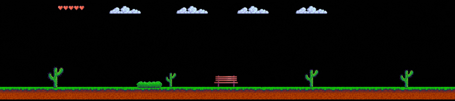

### Hi there 👋

I'm Corey! 🙂
I am a Software Engineer in the Pacific NW. I am computer science enthusiast skilled in full-stack development and JavaScript. A naturally curious individual who loves problem-solving, continuous learning, and appreciating life's simple pleasures.

My Tech Stack 💻 

- Languages: JavaScript (AJAX, JSON), HTML, CSS, SQL 
- Frameworks & Libraries: React (Hook, Redux), Vue, jQuery, Bootstrap, Node.js (Express.js, Inquirer.js, File System, Sequelize), Handlebars.js, Recharts.js, 
- Tools: MongoDB, MySQL, Git, GitHub, Command Line, Heroku, Jest, VSCode

My Links ⛓ 

[LinkedIn](https://www.linkedin.com/in/corey-vasser/)

[Portfolio](https://spamdalfz.github.io/portfolio-project/)

Get in contact with me ✉️ 

Email: coreyvasser@gmail.com
